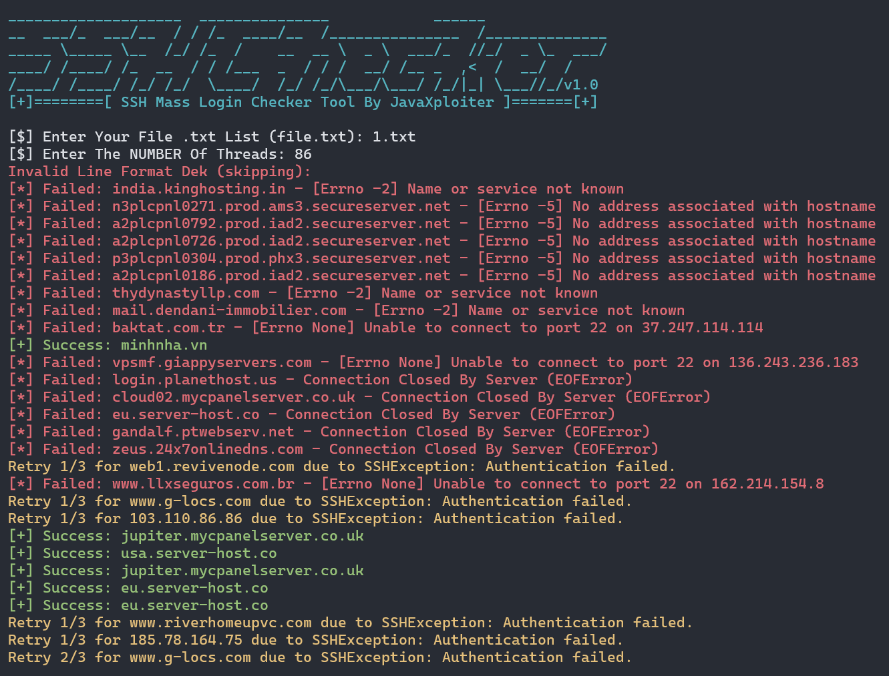

<div align="center">
    
</div>

# SSH Mass Login Checker Tool v1.0

### 🔥Deskripsi
*Alat ini memungkinkan kamu untuk mencoba login SSH ke sejumlah server secara bersamaan menggunakan kredensial yang ada dalam file input. Setiap server yang berhasil login akan disimpan dalam file hasil `success_logins.txt`. Alat ini menggunakan threading untuk menjalankan login secara paralel, sehingga dapat menghemat waktu saat mencoba login ke banyak server.*

### ✨Fitur
- Login SSH secara massal ke server yang ditentukan.
- Menggunakan threading untuk menjalankan login secara paralel.
- Hasil login yang berhasil akan disimpan dalam file `success_logins.txt`.
- Output berwarna menggunakan `colorama` untuk membedakan status berhasil dan gagal.

### 📸 Tangkapan Layar


### 🔐Persyaratan
Untuk menjalankan alat ini, kamu perlu menginstal beberapa paket Python terlebih dahulu:
- `paramiko` untuk mengelola koneksi SSH.
- `colorama` untuk memberikan warna pada output terminal.

Jalankan perintah berikut untuk menginstal dependensi yang dibutuhkan:
```bash
pip install paramiko colorama
```

### 📜Format File Input
File input yang digunakan harus memiliki format sebagai berikut:
```
hostname|username|password
```
Contoh:
```
192.168.1.1|root|password123
192.168.1.2|admin|admin123
```

### ⚙️Cara Menggunakan
1. **Siapkan file input:** 
   Buat file teks yang berisi daftar server dan kredensial dalam format yang telah disebutkan di atas. Sebagai contoh, buat file `file.txt` dengan daftar server.
   ```bash
   git clone https://github.com/JawaTengahXploit1337/SSH-Checker.git
   ```

2. **Jalankan Skrip:**
   Setelah memastikan semua paket terinstal dan file input sudah siap, jalankan skrip dengan perintah berikut:
   ```bash
   python3 ssh.py
   ```

3. **Masukkan Nama File Input:**
   Setelah menjalankan skrip, kamu akan diminta untuk memasukkan nama file yang berisi daftar server dan kredensial (misalnya `file.txt`).

4. **Masukkan Jumlah Thread:**
   Kamu juga akan diminta untuk memasukkan jumlah thread yang ingin digunakan. Semakin banyak thread, semakin cepat proses login, namun pastikan sistemmu cukup kuat untuk menangani jumlah thread yang banyak.

5. **Lihat Hasil:**
   Setelah proses selesai, file `results/success_logins.txt` akan berisi daftar server yang berhasil login beserta username dan password yang digunakan.

### 💯Contoh Output
- **Berhasil:** 
  ```
  Success: 192.168.1.1
  ```
- **Gagal:** 
  ```
  Failed: 192.168.1.1 - Authentication failed.
  ```

### ⚠️Peringatan
❗ Disclaimer
- Skrip ini hanya untuk tujuan pendidikan dan penggunaan yang sah. Jangan gunakan untuk kegiatan yang melanggar hukum atau peraturan yang berlaku.
- Pastikan kamu memiliki izin untuk mengakses server yang dituju.

### 🚀*Dukung Saya Di Saweria*

<a href="https://saweria.co/AsmaraHancur" target="_blank"></a>
